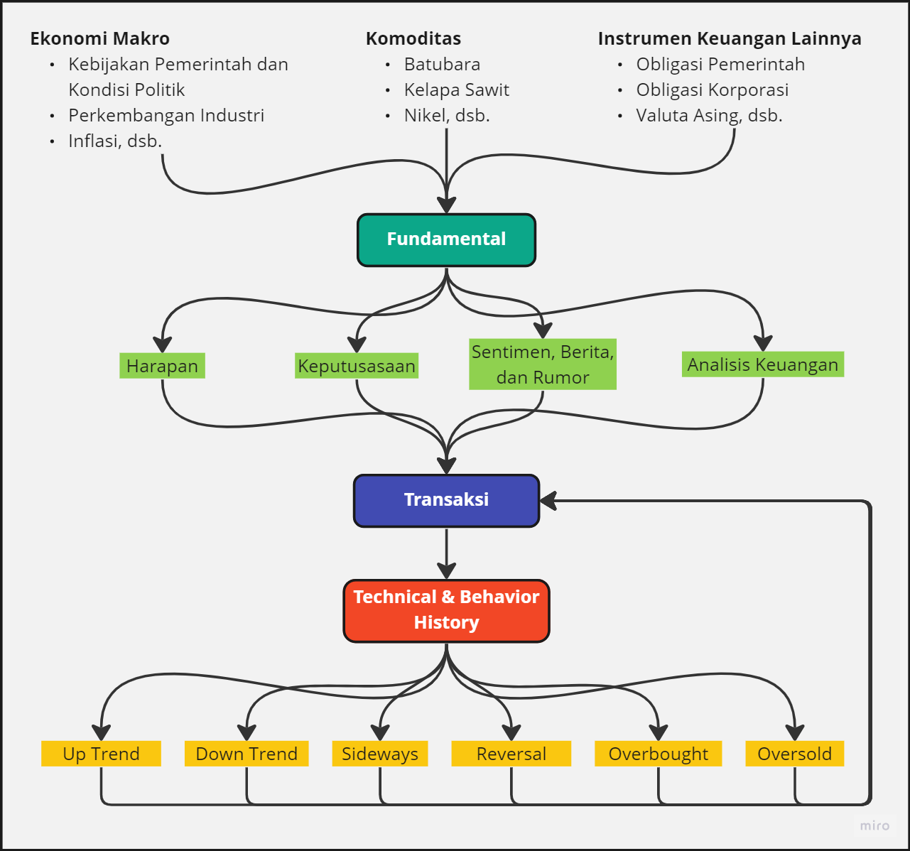
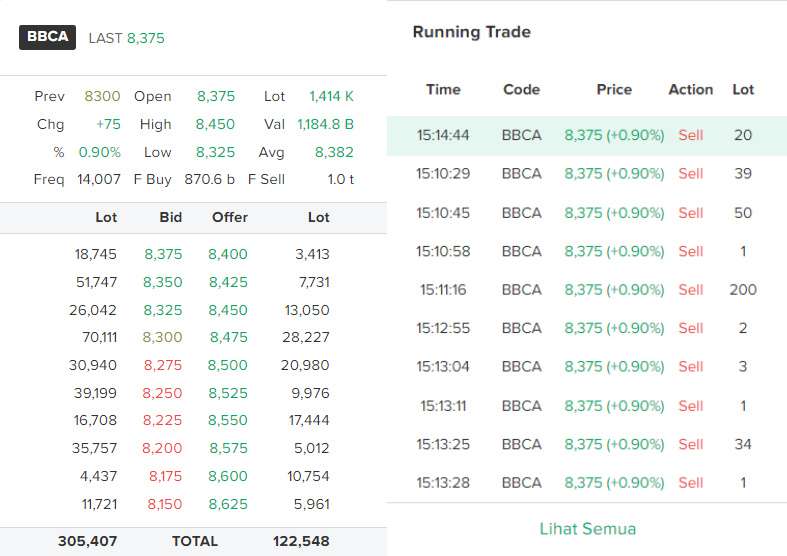
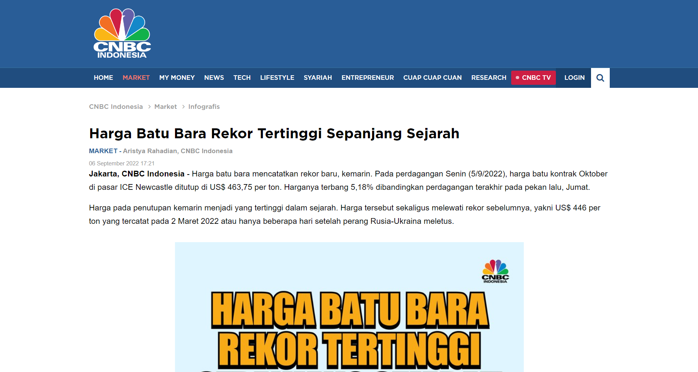
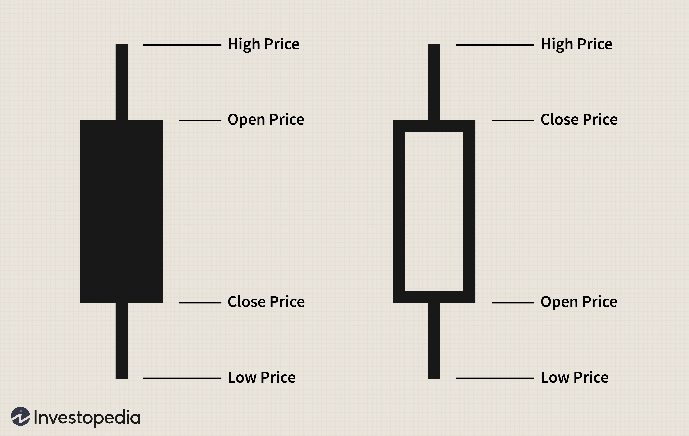
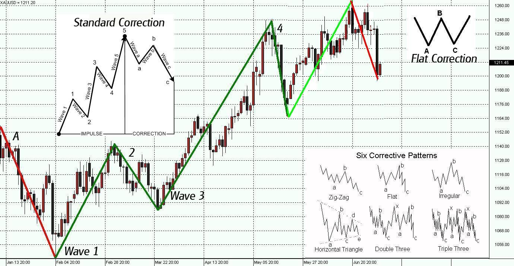

# Analisis Saham secara Top-Down: Fundamental vs Transaksi vs Teknikal

> “*When you have managed the downside, the only way forward is up.”*

Seringkali kita temukan perdebatan antar investor saham yang menggunakan masing-masing jenis analisis andalannya, baik itu analisis fundamental, analisis teknikal, maupun analisis transaksi atau lebih dikenal dengan bandarmologi. Namun apabila kita *zoom-out*, seluruh jenis analisis tersebut adalah **satu-kesatuan siklus market** yang tidak terpisahkan. Tidak ada salahnya kita sebagai investor untuk mempelajari seluruh analisis tersebut dan mengharapkan hasil investasi yang lebih baik, sesuai dengan kutipan di atas.

*Top Down Analysis: Fundamental - Transaksi - Teknikal (source: Quantist.io)*

## Pertanyaan Mendasar

Sebelum melangkah lebih jauh, penting untuk sekilas memahami ketiga analisis tersebut. Fundamental merupakan analisis terhadap kinerja perusahaan secara keseluruhan, seperti laba bersih, pendapatan, dan faktor-faktor internal perusahaan yang mempengaruhi harga saham. Transaksi melihat aktivitas jual-beli saham yang terjadi di pasar. Sedangkan teknikal melihat histori dan pola pergerakan harga saham dalam jangka waktu tertentu.

Mari kita kupas satu per satu ketiga analisis tersebut dengan mengawalinya dengan pertanyaan sederhana,

::: warning ❓ Pertanyaan
Apa yang menyebabkan harga suatu saham bergerak?
:::

## Analisis Transaksi

Harga saham tidak ditentukan oleh perusahaan yang bersangkutan, Bursa Efek Indonesia (IDX), atau Pemerintah Indonesia. Harga saham ditentukan oleh transaksi terakhir melalui pasar reguler. Transaksi-transaksi tersebut tercatat dalam running trade, dengan daftar antrian jual dan beli yang terlihat pada order book saham.

*Order Book dan Running Trade sebagai gamabaran Transaksi BBCA*

Semakin banyak investor *melahap* antrian offer pada order book, maka harga saham akan mengalami kenaikan. Sebaliknya, semakin banyak investor *membuang* ke antrian bid pada order book, maka harga saham akan bergerak turun. Sehingga, meskipun suatu perusahaan dikatakan akan meraih laba yang sangat besar, namun anda sebagai pemegang saham memutuskan untuk menjual saham tersebut di harga rendah (meski hanya 1 lot), maka harga akan tetap turun.

Maka dari itu, harga saham secara real-time hanya dipengaruhi oleh tekanan jual dan tekanan beli dari investor. Dengan kata lain, sesuai dengan konsep ekonomi sederhana, ***pergerakan harga dipengaruhi oleh besarnya permintaan dan penawaran (Supply and Demand) di pasar***.

::: info Analisis Transaksi
Analisis transaksi atau bandarmologi dapat menjawab minat investor atas suatu saham dengan membandingkan **mana yang lebih besar antara tekanan beli, dan tekanan jual**.
:::

>Further Read: [Membaca Siklus Transaksi pada Foreign Flow Analysis dengan Foreign Radar](../dasar-foreign-flow-analysis/membaca-siklus-transaksi-pada-foreign-flow-analysis-dengan-foreign-radar.md)

*Supply and demand* di pasar tentu saja didorong oleh motivasi yang berbeda-beda dari para investor, maka timbul pertanyaan selanjutnya.

::: warning ❓ Pertanyaan
Mengapa seorang investor memutuskan untuk menjual atau membeli saham?
:::

## Analisis Fundamental

Analisis Fundamental menitikberatkan pada kondisi fundamental perusahaan. Selain kinerja internal perusahaan, kondisi eksternal seperti ekonomi makro (kebijakan pemerintah, kondisi politik dan perang, inflasi, perkembangan pasar dan industri), pergerakan harga komoditas yang menjadi bahan baku, atau instrumen keuangan lainnya seperti valuta asing yang digunakan sebagai alat transaksi atau dasar nilai hutang juga memengaruhi kondisi perusahaan.

*Contoh berita harga batu bara (source: CNBC Indonesia)*

Pengaruh internal dan eksternal tersebut akan memengaruhi kinerja perusahaan saat ini dan di masa depan. Jika terdapat sentimen baik, maka semua orang mau membeli, kemudian siapa yang akan menjual sahamnya?

Sayangnya, informasi internal dan eksternal perusahaan bersifat asimetris, yang berarti tidak semua orang melihat data yang sama dengan kacamata yang sama. Informasi yang asimetris ini akan menghasilkan keputusan-keputusan transaksi dengan berbagai alasan, seperti harapan, keputusasaan, mengikuti rumor, atau memiliki perhitungan analisis keuangan yang lebih mendalam dengan data dan informasi tambahan lainnya.

Sebagai contoh, harga batu bara yang mencapai rekor tertinggi bagi sebagian orang merupakan sentimen positif karena menambah profit dari perusahaan penambang batu bara. Namun bagi sebagian orang lainnya, hal ini merupakan sentimen negatif karena batu bara yang dahulu merupakan energi murah kini menjadi mahal dan bisa digantikan dengan energi lain.

::: info Analisis Fundamental
Analisis fundamental dapat menjawab “***WHY***”, yaitu alasan di balik keputusan seorang investor untuk menjual atau membeli saham. Meski demikian, analisis ini tidak dapat menghasilkan satu interpretasi karena adanya informasi asimetris.
::: 

Namun investor tentu bukan hanya diri anda sendiri, serta terjadi jutaan transaksi di bursa, maka muncullah pertanyaan selanjutnya.

::: warning ❓ Pertanyaan
Apa hasil adanya transaksi jual-beli saham oleh para investor?
:::

## Analisis Teknikal

Transaksi yang terjadi selama 1 hari tersebut akan menghasilkan data historis, misalnya berupa satu candlestick harian dengan nilai Open-High-Low-Close, volume, frekuensi, broker summary, done detail, hingga distribusi kepemilikan saham.

*Candle Stick (Source: Investopedia)*

*Chart Pattern*

Jika 1 candlestick tersebut dikumpulkan, maka akan menjadi chart yang dapat dipelajari statistik dan pola pergerakannya. Data inilah yang dicerna oleh analisis teknikal sehingga menghasilkan informasi probabilitas kecenderungan pergerakan harga saham untuk keputusan jual beli. Salah satu prinsip yang digunakan dalam penggunaan histori harga saham ini adalah ***History Repeat Itself.*** Selain itu juga, seorang *technical analyst* memiliki asumsi utama dengan Dow Theory, yaitu ***Market Discount Everything***. Pergerakan saham merupakan cerminan dari segala sesuatu yang terjadi di internal dan eksternal perusahaan atas saham tersebut, dari segi fundamental, sentimen, hingga psikologis pasar.

Hasil analisis teknikal ini sayangnya tidak dapat menghasilkan 1 interpretasi kondisi pasar karena setiap analis melihat dari rentang waktu yang berbeda dan dengan teknik yang berbeda. Analisis transaksi dapat menghasilkan kesimpulan suatu saham saat ini dalam keadaan up-trend, down-trend, sideways, reversal, overbought, atau oversold.

::: info Analisis Teknikal
Analisis Teknikal dapat menjawab probabilitas kecenderungan pergerakan harga pada suatu waktu dengan prinsip *History Repeat Itself,* dan *Market Discount Everything*. Namun analisis ini tidak dapat menghasilkan satu interpretasi karena adanya perbedaan rentang waktu yang digunakan tiap analis.
:::

## Preferensi Quantist.io dalam Top-Down Analysis

Seperti yang dikatakan pada kutipan pembuka artikel ini, langkah pertama yang dilakukan oleh [Quantist.io](https://quantist.io/) adalah membatasi risiko. Kita tidak ingin kehilangan uang di pasar, dan kita juga tidak ingin mengambil risiko besar hanya untuk mendapatkan keuntungan kecil.

Pertama-tama, kita memfilter saham-saham dengan trend fundamental yang kuat secara internal, serta berada pada siklus sentimen yang baik dari faktor eksternal. Setelah itu, dengan analisis transaksi yang tepat, kita dapat membuat keputusan investasi yang tepat - apakah kita harus membeli atau menjual. Analisis transaksi adalah metode utama yang kita gunakan karena hasilnya sangat jelas: jika tekanan jual lebih besar daripada tekanan beli, maka kita harus menjual; jika tekanan beli lebih besar daripada tekanan jual, maka kita harus membeli.

Terakhir, untuk membatasi risiko kita menggunakan analisis teknikal untuk menentukan *Maximum Drawdown* atau kerugian maksimum yang mungkin terjadi, serta menetapkan titik target harga kenaikan untuk memperoleh keuntungan. Dengan menambahkan Money Management yang disiplin, kita dapat menjaga risk/reward ratio dan memperoleh keuntungan secara konsisten.
