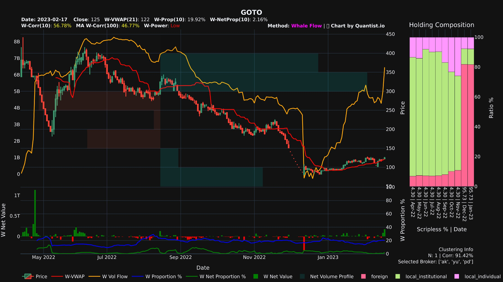

# Komposisi Kepemilikan Saham: Foreign - Local Institusion - Local Individual (Retail)

Pada artikel [💪🏼 Kekuatan Investor Asing di Bursa Efek Indonesia (IHSG)](./kekuatan-investor-asing-di-bursa-efek-indonesia-ihsg), disebutkan **0.34%** entitas di pasar modal, alias investor asing, menguasai hampir setengah modal yang ada di IHSG (45.6%). Jika data tersebut menggambarkan komposisi kepemilikan secara keseluruhan di pasar modal, bagaimana dengan komposisi kepemilikan per sahamnya? 

Foreign Transaction Proportion (Prop), dan Foreign-Price Correlation (PriceCorrel) dapat digunakan untuk mengukur sebarapa signifikan pengaruh asing pada suatus saham sesuai dengan artikel [🎪 Foreign Flow Analysis pada Saham Indonesia](./foreign-flow-analysis-pada-saham-indonesia). Namun kita juga dapat melihat komposisi kepemilikan per saham secara real dari data yang diterbitkan KSEI setiap bulannya.

## Data Kepemilikan Efek KSEI

KSEI merilis [***data kepemilikan efek***](https://www.ksei.co.id/archive_download/holding_composition) setiap bulannya untuk seluruh efek, baik saham hingga obligasi, yang terdaftar pada bursa efek indonesia. Baik investor asing ataupun investor lokal, KSEI membagi masing-masing investor dengan kategori yang disebutkan di bawah.

::: tip 💡 Kategori Sektor Kepemilikan Efek KSEI
- IS: Insurance
- CP: Corporate
- PF: Pension Fund
- IB: Financial Institution (Investment Banking)
- ID: Individual
- MF: Mutual Fund
- SC: Securities Company
- FD: Foundation
- OT: Others
:::

")
*Komposisi Kepemilikan Saham BMRI (chart by [Quantist.io](https://quantist.io))*

Untuk keperluan analisis transaksi, kategori di atas dapat kita bagi menjadi 3 cluster pada bar-chart Holding Composition di sebelah kanan, yaitu:
::: info 📊 Cluster Kategori Kepemilikan Saham
- **Investor Asing** (pink tua paling bawah)    
    All foreign category
- **Investor Institusi Lokal** (hijau pada bagian tengah)   
    Insurance, Corporate, Pension Fund, Financial Institution, Mutual Fund, Securities Company, Foundation, dan Others Lokal
- **Investor Individu Lokal** (pink muda bagian atas)   
    Individual Lokal
:::

## Menggunakan Komposisi Kepemilikan Saham dalam Analisis Transaksi

Dapat kita manfaatkan informasi komposisi kepemilikan saham paling tidak dengan cara-cara berikut.

### 1. Memilih Jenis Analisis Transaksi: Foreign Flow - Whale Flow

Suatu saham yang sedikit dimiliki oleh asing sebaiknya menggunakan analisis transaksi secara umum, yaitu *whale flow* untuk mendapatkan hasil yang lebih sesuai. Berikut merupakan contoh saham ERAA yang mayoritas dimiliki oleh investor Institusi Lokal, dan saham BBCA yang mayoritas dimiliki oleh investor asing.

")
*Saham ERAA yang mayoritas dimiliki investor institusi lokal, dianalisis dengan Whale Flow (chart by [Quantist.io](https://quantist.io))*

")
*Saham BBCA yang mayoritas dimiliki investor asing, dianalisis dengan Foreign Flow (chart by [Quantist.io](https://quantist.io))*

### 2. Melihat Akumulasi/Distribusi secara Menyeluruh

Jika menggunakan foreign flow atau whale flow saja, kurang tergambarkan dari mana saham yang diakumulasi itu berasal, atau ke siapa saham yang didistribusi tersebut tertampung. Dengan komposisi kepemilikan saham, kita dapat melihat semisal saham yang telah ditinggalkan oleh asing dan didistribusikan ke individu lokal. Berikut merupakan contoh saham ICBP yang diakumulasi oleh aisng dari retail, dan saham ACES yang didistribusikan dari investor asing ke investor retail.

")
*Saham ICBP yang diakumulasi oleh asing (chart by [Quantist.io](https://quantist.io))*

")
*Saham ACES yang didistribusikan oleh asing ke Investor Retail (chart by [Quantist.io](https://quantist.io))*

### 3. Menghindari Saham dengan Mayoritas Individu Lokal

Sebagaimana kita tahu, semakin banyak investor individu lokal, maka akan semakin banyak kepala di dalamnya, dan tidak ada “pengendali” atas pergerakan harga saham tersebut. Sebaiknya saham seperti ini kita hindari dalam melakukan trading.

*Saham PADI yang harganya tidak bergerak di Rp 50 dengan kepemilikan investor individu lokal 80%*

## Scripless Ratio

::: tip 💡 Saham Scripless
Scripless Trading adalah perdagangan efek tanpa adanya fisik efek berupa sertifikat saham sehingga menggunakan warkat yang telah dikonversi menjadi scripless.
:::

Dalam menganalisis komposisi kepemilikan saham, perlu kita perhatikan Scripless Ratio saham tersebut. Saham yang dapat diperjualbelikan pada pasar modal adalah saham-saham yang telah berbentuk scripless. Jika scripless ratio masih kurang dari 100%, berarti masih terdapat saham yang dipegang oleh institusi dan tidak dapat diperjualbelikan.

Scripless Ratio yang masih jauh kurang dari 100% akan menimbulkan bias dalam analisis. Sebagai contoh saham GOTO di bawah. Pada bulan November 2022 dan sebelumnya, saham yang dapat diperjualbelikan hanya sebesar 4.3% dan dikuasai oleh institusi lokal. Sementara pada Desember 2022 dan setelahnya scripless ratio menjadi 95.73% dan terlihat pemilik saham mayoritas sebenarnya adalah investor asing, bukan investor institusi lokal.

*Saham GOTO dengan Scripless Ratio kurang dari 100%*

Hal ini perlu menjadi perhatian, karena bisa jadi hampir seluruh saham scripless terdistribusi ke investor individu lokal, namun sebenarnya masih banyak saham yang disimpan oleh institusi yang belum berbentuk scripless. Berikut contoh saham KRYA dengan Scripless Ratio 51.78% dengan kepemilikan individu lokal hampir 100%.

*Saham KRYA dengan kepemilikan individu lokal hampir 100%*

## Reference

[PT Kustodian Sentral Efek Indonesia - ArchiveDownload](https://www.ksei.co.id/archive_download/holding_composition)
